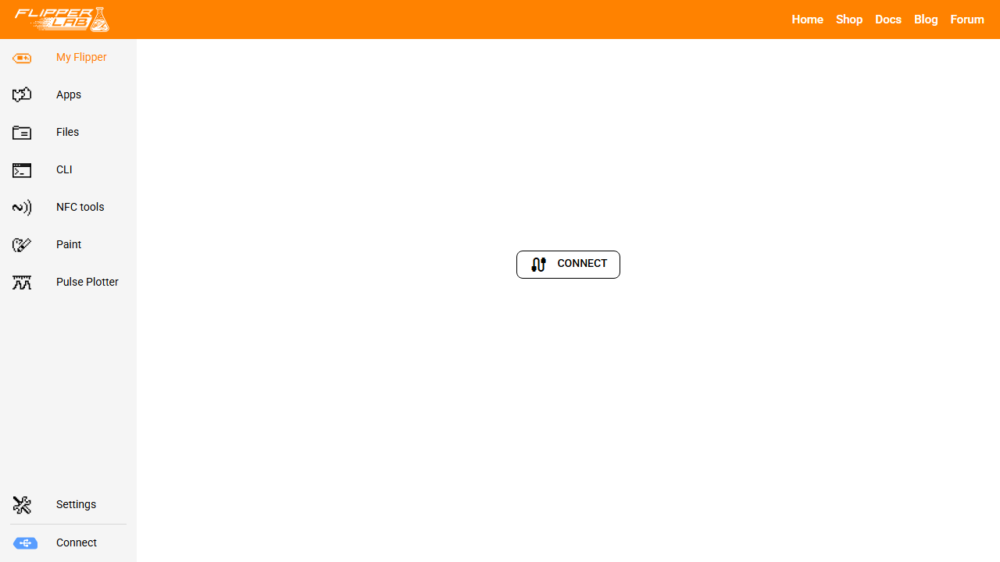

# Nuerolynx Firmware

Nuerolynx Firmware is my custom Flipper Zero build for physical security work, electronics troubleshooting, embedded development, and authorized lab research.

It is built on Momentum Firmware and keeps the broad application, protocol, and hardware support of that project. My work adds a focused Nuerolynx interface and practical tools that connect credential inspection, field diagnostics, and electronics work in one device.

## Download

[Download the current Flipper Zero update package](../../releases/latest/download/Nuerolynx-Flipper-Firmware.tgz)

This is the only file needed for installation. It ends in `.tgz` because that is the compressed updater package format used by Flipper Lab and qFlipper. It works like a purpose-built firmware zip. Do not extract it, rename it, or copy its individual files to the device.

The current package is a development preview. It is intended for experienced Flipper Zero owners who are comfortable testing custom firmware and restoring official firmware if needed.

## What is inside the update package

The single download contains everything the updater needs.

- The Nuerolynx firmware image
- The matching radio firmware and update manifest
- The updater used by the Flipper Zero during installation
- SD card resources, icons, animations, and the Nuerolynx interface assets
- The organized application library and Smart Search
- NLX Credential Suite for passive credential inspection in authorized work
- NLX Electrical Calculator for Ohm's law, voltage drop, and conductor sizing
- GPIO logic analyzer and smart meter monitoring tools

Flipper Lab reads this package and places each part where it belongs. There is no separate application bundle or manual file copy step.

## Who should install it

This build is meant for physical security technicians, embedded developers, electronics troubleshooters, home lab builders, and curious Flipper Zero owners who want a practical diagnostic platform.

Use it only with equipment you own or systems you have clear permission to assess. Anyone who needs the official Flipper Devices support path or prefers a stable general use release should remain on official firmware.

## Why I built it

I wanted one portable tool that reflected how I learn and work. I often move between access control, electronics, firmware, radio systems, and networked equipment. Nuerolynx Firmware brings those related tasks into a consistent interface while keeping useful upstream work intact.

The goal is not to collect every possible feature. The goal is to make common lab and field workflows easier to understand, easier to reach, and easier to document.

## What it adds

### Nuerolynx interface

The firmware has its own device identity, boot artwork, update artwork, icons, menu labels, and default asset pack. Settings, menu entries, and keybinds migrate during upgrades so a new build does not needlessly reset the device.

The animated status trace advances during normal display redraws. It does not use a separate wake timer, which limits its effect on battery life.

### Organized application library

Applications are grouped into shorter working categories such as diagnostics, programming, credentials, field tools, radio analysis, and calculators. Existing application data stays in its original location, and the loader can resolve saved shortcuts that still point to an older app path.

Smart Search checks application names, filenames, category paths, and practical terms. Searches such as `wire gauge`, `credential`, or `logic analyzer` lead to the related tool without requiring the user to remember its folder.

### NLX Credential Suite

The Credential Suite gives authorized technicians one passive scan flow for NFC smart cards, Picopass and iCLASS, 125 kHz RFID, and iButton credentials.

It can retain more than one technology from the same credential, decode supported Wiegand formats, save readable inspection reports, and open an appropriate specialist tool for deeper authorized work.

Normal scanning does not write, emulate, recover keys, or fuzz credentials. Those actions require a deliberate Authorized Lab acknowledgment and remain in their separately maintained specialist applications.

### NLX Electrical Calculator

The electrical calculator solves Ohm's law and performs two conductor voltage drop and wire sizing calculations. Results include current, loop resistance, voltage drop, delivered voltage, wire loss, maximum run length, and the smallest supported conductor that meets the selected target.

It is a design aid. It does not replace ampacity calculations, product listings, installation requirements, or applicable electrical codes.

### Diagnostic tools

The build includes a GPIO logic analyzer for tracing digital signals and saving captures. It also includes a smart meter radio monitor for observing compatible 433 MHz, 868 MHz, and 915 MHz meter activity.

These tools make the Flipper more useful for following signals, checking field wiring, inspecting credential systems, and understanding how devices communicate.

## Back up before installing

Use the Backup control in qFlipper to save the device's internal data. Copy the contents of the SD card to the computer separately because the qFlipper internal backup does not include SD card data.

Confirm that the Flipper has a working SD card and enough battery charge before starting. Use a USB data cable and keep it connected until the update finishes and the device restarts.

## Install with Flipper Lab

Flipper Lab works in a browser and does not require the qFlipper desktop application.

1. Download the update package from the link above.
2. Close qFlipper and any other program using the Flipper USB connection.
3. Connect the Flipper Zero to the computer with a USB data cable.
4. Open [Flipper Lab](https://lab.flipper.net/) in Chrome or Edge.
5. Select Connect and choose the Flipper Zero in the browser device window.
6. Select Install from file after the device page opens.
7. Choose `Nuerolynx-Flipper-Firmware.tgz` without extracting it.
8. Keep the cable connected while the package uploads, installs, and restarts the device.



The connection screen contains no personal device information. After connecting, the device panel displays the Install from file control used for the update package.

## Install with qFlipper

1. Download and install [qFlipper from Flipper Devices](https://flipperzero.one/update).
2. Download the Nuerolynx update package from the link above.
3. Open qFlipper and connect the Flipper Zero with a USB data cable.
4. Select Install from file.
5. Choose `Nuerolynx-Flipper-Firmware.tgz` without extracting it.
6. Wait for qFlipper and the Flipper Zero to report that the update is complete.

Do not disconnect the cable or remove the SD card while the update is running.

## Verify the installation

After the device restarts, open the device information screen in Flipper Lab or qFlipper. The current development build reports `Nuerolynx dev` as its firmware identity.

Open Applications and confirm that the NLX Credential Suite and NLX Electrical Calculator are present. Existing user data should remain available after a normal updater installation.

## Return to official firmware

If the update fails or the device does not boot correctly, connect it to qFlipper and use the Repair workflow to restore official firmware. Restore internal data from the qFlipper backup and restore SD card files from the separate copy after the device is working normally.

[Flipper Devices documents qFlipper backup, repair, and firmware management here](https://docs.flipper.net/zero/qflipper).

## Build from source

Clone the repository with its submodules and use the included Flipper Build Tool.

```powershell
git clone --recursive https://github.com/nuerolynx/Nuerolynx-Flipper-Firmware.git
Set-Location Nuerolynx-Flipper-Firmware
.\fbt.cmd dist_updater_package
```

The generated update package is written beneath `dist\f7-C`.

## Verification completed

The current source passes the host test suites for the NLX Credential Suite and NLX Electrical Calculator. The complete updater package also builds successfully and contains the organized application library, Smart Search, credential suite, electrical calculator, GPIO logic analyzer, smart meter monitor, firmware image, radio image, updater, and SD card resources.

## Credits and license

Nuerolynx Firmware is distributed under the GNU General Public License version 3.

It is derived from [Momentum Firmware](https://github.com/Next-Flip/Momentum-Firmware), which includes work from Flipper Devices and many independent application and protocol authors. Original licenses, copyrights, application credits, and compatibility identifiers are preserved.

The GPIO logic analyzer and smart meter monitor retain their original UberGuidoZ attribution and licensing. The NLX Electrical Calculator retains the original VoltCalc credit and MIT license from Andrew Diamond.

See [UPSTREAM.md](UPSTREAM.md) for the recorded upstream base and attribution details.
